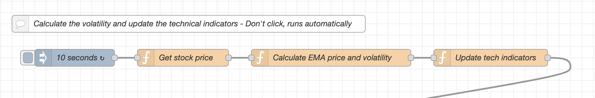
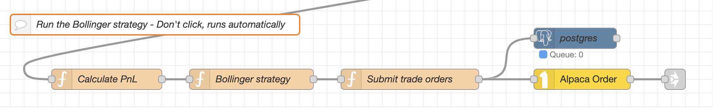

### Configuration of the Bollinger Strategy in MachineTrader  

The *Bollinger strategy* trades a single stock during market trading hours, using intraday stock prices.  Each day it starts trading at the market open with a clean slate (reset to its base state), and it stops trading at the market close.  It liquidates all its positions just before the market close.  Its state is reset overnight to its base state.  

You can read more about the theory of the Bollinger strategy in 
[**this document**](https://drive.google.com/uc?export=download&id=1TJbRuMPEH0lWYzyeTOBk54uQpOAa216o).  

The *Bollinger* strategy requires installing four tabs into your MachineTrader instance.  
The tabs named [**Bollinger Strategy**](https://drive.google.com/uc?export=download&id=1df_JXndPT0V3vZvavP8JSuiKjEJH4f_5), [**Tech Indicators**](https://drive.google.com/uc?export=download&id=1gOpD8O4JOah5xTCVcmQi4qNdmSVliTgr), [**Alpaca Prices**](https://drive.google.com/uc?export=download&id=1H92YpZfPy8La5pZzQ0kgjxjyiVAaFhb2), and [**Globals/Utilities**](https://drive.google.com/uc?export=download&id=1oFoWkaqhfetSZcvu8kGsFGNwpmrx2bBZ).
Just click on the highlighted names to download them from the [**MachineTrader Community**](https://drive.google.com/drive/u/3/folders/1Hc_tiaC_W8ZutVBDZewkvE9cZbd6y2BI) share drive.  

After you import all the above four tabs into your MachineTrader instance, you must connect their *link-in nodes* with the appropriate *link-out nodes* in the other tabs.  

 

You can click this [**link**](https://drive.google.com/uc?export=download&id=1df_JXndPT0V3vZvavP8JSuiKjEJH4f_5) to the MachineTrader Community share drive, to download the file named *Bollinger_Strategy.json*, containing the *JavaScript* code for the tab named *Bollinger Strategy*.  You can then upload this *JavaScript* file to your MachineTrader instance, to run the *Bollinger* strategy.  

The *Bollinger* strategy also requires installing three other tabs into your MachineTrader instance.  

You also need to install in your instance the tab named [**Tech Indicators**](https://drive.google.com/uc?export=download&id=1gOpD8O4JOah5xTCVcmQi4qNdmSVliTgr) for calculating the moving average prices and volatilities.  

You also need to install in your instance the tab named [**Alpaca Prices**](https://drive.google.com/uc?export=download&id=1H92YpZfPy8La5pZzQ0kgjxjyiVAaFhb2) for downloading the streaming (live) stock prices from Alpaca.  

You also need to install in your instance the tab named [**Globals/Utilities**](https://drive.google.com/uc?export=download&id=1oFoWkaqhfetSZcvu8kGsFGNwpmrx2bBZ) for creating global variables.

After you import all the above four tabs into your MachineTrader instance, you must connect their *link-in nodes* with the appropriate *link-out nodes* in the other tabs. 

 

### Implementation of the Bollinger Strategy  

**The tab named *Bollinger Strategy* executes the Bollinger strategy in real time.**  

Let's look at the different flows in the tab named *Bollinger Strategy*.  

At the top of the tab, there are flows for downloading the documentation.  You can click on the gray inject nodes to download the documentation.  The second flow downloads the current file you're reading.  
{width="500" height="250"}  

 

**The flows below create the flow variables in the tab [**Bollinger Strategy**](https://drive.google.com/uc?export=download&id=1df_JXndPT0V3vZvavP8JSuiKjEJH4f_5).**  
Flow variables are variables that are shared between the different nodes in the same tab.  Once the variables are created, they can be used in other function nodes in the same tab.  
You need to run (click) these flows once before the other flows are run.  

The function called *Create flow variables* creates the flow variables, such as the stock symbol to trade, the threshold level for the z-score, the position limit (the maximum number of shares the strategy can own at any time), etc.  

The functions called *Create table *tableSubmits** and *Create table *tableFills** create empty PostgreSQL tables (if they don't already exist), for storing the submitted orders and for the executed (filled) orders.  
The table called *tableSubmits* is filled with the orders submitted to the broker API, and the table called *tableFills* is filled with the orders that were confirmed by the broker.  
These two tables are erased overnight, so they start empty at the beginning of each trading day.  
{width="600" height="300"}  

 

**The flows below initialize the prices and technical indicators.**  These flows run automatically -  you don't need to click on them.  

The first flow initializes the flow variables such as the open position queue, etc., each day just before the market open.  
The function node called *Initialize flow variables* resets the flow variables to their initial values.  
The second flow initializes the flow variables with the prices from the tab [**Tech Indicators**](https://drive.google.com/uc?export=download&id=1gOpD8O4JOah5xTCVcmQi4qNdmSVliTgr), each day at the market open.  
The *link-in node* must be connected with the appropriate *link-out node* in the tab [**Tech Indicators**](https://drive.google.com/uc?export=download&id=1gOpD8O4JOah5xTCVcmQi4qNdmSVliTgr).  
{width="600" height="200"}  

 

**The flow below updates the technical indicators with live data.**  The flow runs automatically -  you don't need to click on it.  

The function called *Update tech indicators* obtains the moving average prices and volatilities from the tab [**Tech Indicators**](https://drive.google.com/uc?export=download&id=1gOpD8O4JOah5xTCVcmQi4qNdmSVliTgr), and it calculates the z-scores.  
The *link-in node* must be connected with the appropriate *link-out node* in the tab [**Tech Indicators**](https://drive.google.com/uc?export=download&id=1gOpD8O4JOah5xTCVcmQi4qNdmSVliTgr).  
The function called *Unrealized PnL* calculates the unrealized profits and losses (PnLs) for the open positions, and also the PnL drawdown from its maximum.  
{width="700" height="200"}  

 

**The flow below runs the *Bollinger strategy*.**  The flow runs automatically -  you don't need to click on it.  

The first function in this flow called *Bollinger strategy* obtains the z-score from the function called *Update tech indicators* in the flow above it.  
The function *Bollinger strategy* compares the z-score with the threshold level $\theta$, it then calculates the number of shares to buy or sell, and passes it into the function called *Submit trade orders*.  
The function called *Submit trade orders* creates a string with the trade order, and passes it into the yellow Alpaca API node. It also writes the submitted trade order into the PostgreSQL table called *tableSubmits*.  
{width="1300" height="200"}  

 

**The flow below liquidates all of the strategy's stock positions at the end of the day.**  The flow runs automatically -  you don't need to click on it.  

The *Bollinger strategy* maintains a queue of the strategy's open positions throughout the day.  
The function called *Liquidate positions* calculates the total open positions in the queue, and it submits a trade order to liquidate them, one minute before the market close.  The function can also liquidate the total open positions reported by Alpaca.  

The function called *Liquidate positions* creates a string with the trade order, and passes it into the yellow Alpaca API node. It also writes the submitted trade order into the PostgreSQL table called *tableSubmits*.  
Pressing the gray inject node called *Liquidate now* liquidates all of the strategy's stock positions at any time during the market trading hours.
{width="1300" height="200"}  

 

**The flow below obtains trade confirmations from Alpaca and inserts them into the fill trades table.**  The flow runs automatically -  you don't need to click on it.  

The function called *Confirm trades* parses the trade confirmations from Alpaca and inserts them into the table *tableFills*.  
It writes the time stamp, the stock symbol, the trade type (buy or sell), the number of shares filled, the fill price, etc.  
This allows the user to track the executed trades and troubleshoot any issues.  
{width="1300" height="170"}  

 

**The flows below execute trades manually.**  

The function called *Buy 1 share* creates a string with the trade order to buy one share of the stock, and passes it into the yellow Alpaca API node. It also writes the submitted trade order into the PostgreSQL table called *tableSubmits*.  
Similarly the function called *Sell 1 share*.  
These functions are activated by pressing the grey inject nodes to their left.  
{width="700" height="200"}  

 

**The flows below create web links for downloading the trade tables to CSV files.**  

The two flows below create web links for downloading the trade tables to CSV files.  You don't need to click on them.  
To download the CSV files to their computer, the user needs to run 
[**this shell script**](https://drive.google.com/uc?export=download&id=1ydjUOZU6T7Ma5KiftYHwKAAvsWAVUBeG).  
{width="1300" height="220"}  

**The flow below sends Telegram alerts.**  The flow runs automatically -  you don't need to click on it.  

The function called *Telegram* parses the positions and PnLs from Alpaca and sends an alert to the user's Telegram account.  
This allows the user to receive alerts if there are any issues, like breached limits, rejected trades, etc.  
It requires initializing the Telegram bot.  
{width="1300" height="150"}  

 

