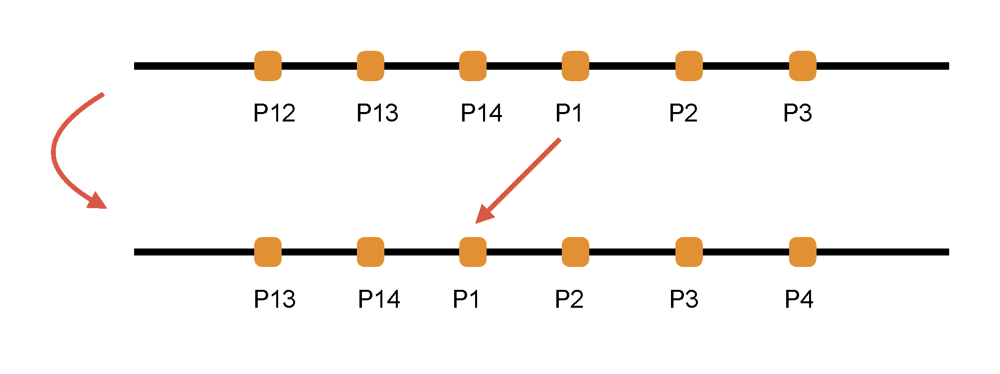
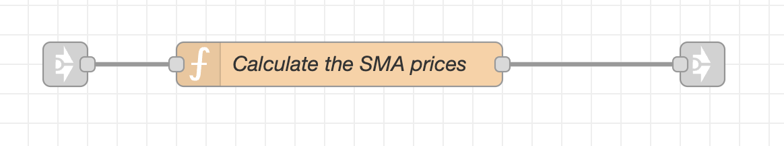
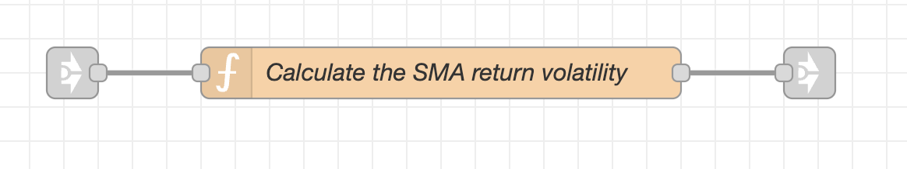
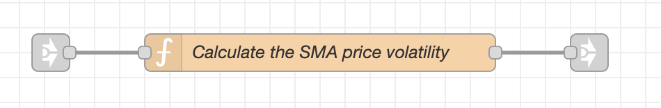

### The Bollinger Strategy  

The strategy buys $1$ share if the stock is cheap (the z-score is less than minus the threshold), and it sells $1$ share if the stock is expensive (the z-score is greater than the threshold).  

The strategy can sell shares short (establish a short share position), if it doesn't own any shares to sell.  

The strategy keeps buying or selling shares, and can accumulate an inventory of long or short shares, until it reaches the position limit.  

The strategy determines if the stock is cheap or expensive depending on the value of the z-score.  

The z-score $z_t$ is equal to the difference between the current price $p_t$ minus the moving average price $\bar{p}_t$, divided by the moving average volatility of the prices $\sigma_t$:

$${\normalsize z_t = \frac{p_t - \bar{p}_t}{\sigma_t}}$$

If the current price $p_t$ is greater than the moving average price $\bar{p}_t$, then the z-score is positive, and vice versa.  

You can read more about the theory of the Bollinger strategy by
[**downloading this**](https://drive.google.com/uc?export=download&id=1TJbRuMPEH0lWYzyeTOBk54uQpOAa216o
).  

### Implementation of the Bollinger Strategy  

**The Node-RED tab named *Single Stock Strategy* contains implementations of various technical indicators in MachineTrader, including the moving average price and volatility.**  

The tab named *Single Stock Strategy* calculates the moving average prices and volatilities from live streaming stock prices for a single selected stock.

You can download the tab named [**Single Stock Strategy**](https://github.com/predictivetechnologysystems/MachineTrader-Community/blob/main/Tech_Indicators.json) from the MachineTrader-Community repository on GitHub.  

You should also download the tabs named [**Alpaca Prices**](https://github.com/predictivetechnologysystems/MachineTrader-Community/blob/main/Alpaca_Prices.json), and [**Globals**](https://github.com/predictivetechnologysystems/MachineTrader-Community/blob/main/Globals_jp.json).  

After you download the tab named *Single Stock Strategy*, you must connect the *link-in node* to the left of the function node named *Get stock price* to the *link-out node* called *Prices out* in the tab *Alpaca Prices*.  

You can also watch an instructional video about [**Calculating Moving Average Prices And Volatilities**](https://youtu.be/iAZMTEZeZDM) on the MachineTrader YouTube channel.  

 

**Let's take a look at the tab named *Single Stock Strategy*.**  

The function node named *Initialize the parameters* creates flow variables needed for the calculations.
It should be run once before the other nodes are run, by pressing the *inject* node on the left.  

The multiple stock prices stream in from the tab *Alpaca Prices* into the node named *Get stock price*, through the small *link-in node* to its left.
The function node *Get stock price* selects the prices only for the ticker in the tab variable *symboln*.
The single stock prices then stream out through the small *link-out node* to its right, to the nodes which calculate the moving averages.  

The dashed lines are the connectors for passing the live streaming stock prices to the function nodes.  

 

**The function node named *Initialize the parameters* creates the flow variables needed for the calculations:**  

It should be run once before the other nodes are run, by pressing the *inject* node on the left.
The *inject* node is on a timer, to run on weekdays at 9:30 AM, so that all the flow variables are initialized before the start of stock trading.

The function node named *Initialize the parameters* creates the following flow variables:  

* symboln = the ticker string of the selected stock. 
* lambdaf = the lambda decay factor which multiplies past estimates. 
* volf = the volatility floor. 
* pricec = the current stock price. 
* pricep = the previous stock price, initially set to NaN. 
* pricema =  the moving average price, initially set to NaN. 
* lb = the look-back window, i.e. the number of elements in the data queue. 
* priceq = the data queue (buffer) for storing the recent stock prices. 
* endpq = the position of the end of the price queue. 
* retq = the data queue (buffer) for storing the recent stock returns. 
* endrq = the position of the end of the returns queue. 

 

**The data queue is used for calculating the simple moving averages of prices and volatilities.**

The data queue is an array (vector) for storing the recent stock prices or returns.
The data queue only stores the most recent number of elements equal to *lb*.  
The data queue is a first in last out queue.
Data is added one element at a time and it's stored in the order it's received.
New data is written to the end of the queue, and the *endq* variable is shifted to the next to last element.  
The element *P14* at the end of the queue is replaced with new data and becomes the element *P1* at the front of the queue.  
The element *P13* becomes the end of the queue *P14*.
The data elements in the queue are just relabeled - not copied.
This avoids copying the other data elements in the queue, which speeds up the code.

Below is an illustration of how an element is added to the data queue:

. 

 

**The function node named *Get stock price* obtains the streaming prices for the ticker *symboln* from the tab named *Alpaca Prices*.**

The prices for all the stocks stream from the tab *Alpaca Prices* into the small *link-in node* on the left.  
The function node *Get stock price* then extracts the prices only for the ticker *symboln*, and it passes them to the small *link-out node* on the right.  The streaming stock prices from the *link-out node* can then be passed to the other nodes and strategy tabs.  

For the live prices to stream, it's necessary to download and install the tabs named *Alpaca Prices* and *Globals*.  Then you must connect the *link-in node* to the left of the function node named *Get stock price* to the *link-out node* called *Prices out* in the tab *Alpaca Prices*.  

 

**The function node named *Calculate the SMA prices* calculates the simple moving average prices.**

The stock prices flow from the node *Get stock price* into the small *link-in node* on the left.  The function node *Calculate the SMA prices* then calculates the simple moving average prices, and it passes them to the small *link-out node* on the right.  The streaming SMA prices from the *link-out node* can then be passed to the other nodes and strategy tabs.  

 

**The function node named *Calculate the EMA prices* calculates the exponential moving average prices.**

The stock prices flow from the node *Get stock price* into the small *link-in node* on the left.  The function node *Calculate the EMA prices* then calculates the exponential moving average prices, and it passes them to the small *link-out node* on the right.  The streaming EMA prices from the *link-out node* can then be passed to the other nodes and strategy tabs.  

 

**The function node named *Calculate the SMA return volatility* calculates the simple moving average volatility of the stock returns.**

The stock prices flow from the node *Get stock price* into the small *link-in node* on the left.  The function node *Calculate the SMA return volatility* then calculates the SMA return volatility, and it passes it to the small *link-out node* on the right.  The streaming SMA return volatility from the *link-out node* can then be passed to the other nodes and strategy tabs.  

 

**The function node named *Calculate the EMA return volatility* calculates the exponential moving average volatility of the stock returns.**

The stock prices flow from the node *Get stock price* into the small *link-in node* on the left.  The function node *Calculate the EMA return volatility* then calculates the EMA return volatility, and it passes it to the small *link-out node* on the right.  The streaming EMA return volatility from the *link-out node* can then be passed to the other nodes and strategy tabs.  

 

**The function node named *Calculate the SMA price volatility* calculates the simple moving average volatility of the stock prices.**

The stock prices flow from the node *Get stock price* into the small *link-in node* on the left.  The function node *Calculate the SMA price volatility* then calculates the SMA price volatility, and it passes it to the small *link-out node* on the right.  The streaming SMA price volatility from the *link-out node* can then be passed to the other nodes and strategy tabs.  

 

**The function node named *Calculate the EMA price volatility* calculates the exponential moving average volatility of the stock prices.**

The stock prices flow from the node *Get stock price* into the small *link-in node* on the left.  The function node *Calculate the EMA price volatility* then calculates the EMA price volatility, and it passes it to the small *link-out node* on the right.  The streaming EMA price volatility from the *link-out node* can then be passed to the other nodes and strategy tabs.  

 

 

### The Moving Average Prices  

The moving average prices can be calculated for a streaming time series of prices $p_t$.  

The Exponential Moving Average (EMA) price $\bar{p}_t$ is calculated using a decay factor $\lambda$ and the recursive formula: 

$${\normalsize \bar{p}_t = \lambda \bar{p}_{t-1} + (1-\lambda) p_t}$$

The moving average price at time $t$: $p_t$ is equal to the decay factor $\lambda$ times the moving average price at time $t-1$: $p_{t-1}$, plus $(1-\lambda)$ times the price at time $t-1$: $\bar{p}_{t-1}$.

The decay factor $\lambda$ determines the persistence of data memory, i.e. how quickly the contribution of the past data to the average value fades over time.  

If the decay factor $\lambda$ is closer to $1$ then the effect of past data fades slowly over time.
If $\lambda$ is closer to $0$ then the effect of past data fades quickly over time.  

The above recursive formula can be expressed as a series:

$${\normalsize \bar{p}_t = (1-\lambda) \sum\limits_{j=0}^{\infty} {\lambda}^j p_{t-j} = (1-\lambda) (p_t + \lambda p_{t-1} + \lambda^2 p_{t-2} + \ldots)} $$

The formula is called *exponential* because the decay factor $\lambda$ is raised to the power of $j$, so the weights $\lambda^j$ decrease exponentially as $j$ increases.  

The advantage of the EMA price is that it applies a greater weight to more recent prices than to past ones.  

The EMA calculation is also faster because there's less computation, and it doesn't require maintaining a buffer (queue) of past prices.  

 

### The Moving Average Variance of Prices  

The moving average variance of prices $\sigma^2_t$ measures the dispersion of the streaming prices around the moving average price.
It can be calculated for a streaming time series of prices $p_t$.  

The Exponential Moving Average (EMA) variance of prices $\sigma^2_t$ is calculated using the two recursive formulas: 

$${\normalsize \sigma^2_t = \lambda \sigma^2_{t-1} + (1-\lambda) (p_t - \bar{p}_{t-1})^2}$$
$${\normalsize \bar{p}_t = \lambda \bar{p}_{t-1} + (1-\lambda) p_t}$$

The moving average variance at time $t$: $\sigma^2_t$ is equal to the decay factor $\lambda$ times the moving average variance at time $t-1$: $\sigma^2_{t-1}$, plus $(1-\lambda)$ times the squared difference between the current price $p_t$ minus the moving average price at time $t-1$: $\bar{p}_{t-1}$.

 

### Choosing The Decay Factor $\lambda$

The moving average prices are a smoothed version of the streaming prices.  

**The decay factor $\lambda$ determines the strength of the data smoothing.**  

If $\lambda$ is closer to $1$ then the moving average prices are smoother, but if it's closer to $0$ then the average prices are more variable and they follow the streaming prices more closely.

The effect of the decay factor $\lambda$ on the moving average prices is illustrated in the animated plot below of VTI stock prices.  When $\lambda = 0.99$ the average prices are very smooth, but as it decreases, they become more variable and they follow the streaming prices more closely.

 

**The moving average prices are less volatile (smoother), but they also lag behind the streaming prices - they are *biased*.**  
Notice for example that the average prices (red line above) reach their minimum much later than the streaming prices (blue line).  
And the smoother the average prices are, the more biased they are.  
A lower variance is desirable, but it comes at the cost of a larger bias (time lag).  
This is called the *bias-variance tradeoff*.  
The *bias-variance tradeoff* is one of the central themes in *machine learning*.  

**The decay factor $\lambda$ and the look-back window $lb$ are usually chosen to achieve the best *bias-variance tradeoff*.**  

The best tradeoff depends on the application.  For example, if the streaming prices are very volatile, then a larger decay factor $\lambda$ is desirable (or a larger look-back window $lb$), to reduce the volatility.

**The optimal value of the decay factor $\lambda$ can be determined using a simulation called *backtesting* (cross-validation).**  

Backtesting is performed on historical data.  
The data is split into in-sample and out-of-sample sets.  
Forecasting models often require the smoothing of the data.  
The smoothing is applied to the in-sample data, and the forecasts are tested on the out-of-sample data.  
The value of $\lambda$ which minimizes the out-of-sample forecast errors is chosen as the optimal value.  

**The backtesting procedure risks *overfitting* to the historical data.**  
The optimal value of $\lambda$ may not be the best choice in live data.
So users should be cautious when selecting parameters using the backtesting procedure.  

