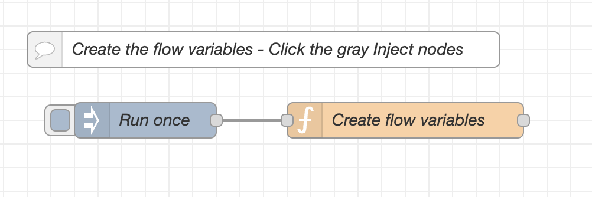
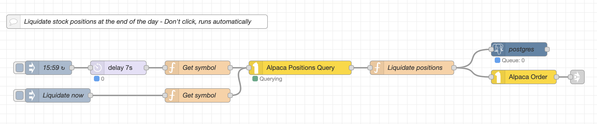

### Configuration of the Bollinger Strategy in MachineTrader  

The *Bollinger strategy* trades a single stock during the market trading hours, using intraday stock prices.  Each day it starts trading at the market open with a clean slate (reset to its base state), and it stops trading at the market close.  It liquidates all its positions just before the market close.  Its state is reset overnight to its base state.  

You can read more about the theory of the Bollinger strategy in 
[**this document**](https://algoquant.github.io/2024/06/13/Bollinger-Strategy-Theory/).  

To implement the *Bollinger strategy* in MachineTrader, you need to install the tab named *Bollinger Strategy* in your MachineTrader instance.  
You can click this [**link**](https://drive.google.com/uc?export=download&id=1df_JXndPT0V3vZvavP8JSuiKjEJH4f_5), to download the file named *Bollinger_Strategy.json* from the MachineTrader Community share drive.  
This file containes the *JavaScript* code for the tab named *Bollinger Strategy*.  You can then import this *JavaScript* file to your MachineTrader instance, and it will create the tab named *Bollinger Strategy*.  

 

### Implementation of the Bollinger Strategy  

**The tab named *Bollinger Strategy* executes the Bollinger strategy in real time.**  

Let's look at the different flows in the tab named *Bollinger Strategy*.  

At the top of the tab, there are flows for downloading the documentation.  You can click on the gray inject nodes to download the documentation.  The second flow downloads the current file that you're reading now.  
{width="500" height="250"}  

 

**The flows below create the flow variables in the tab [*Bollinger Strategy*](https://drive.google.com/uc?export=download&id=1df_JXndPT0V3vZvavP8JSuiKjEJH4f_5).**  
Flow variables are variables that are shared between the different nodes in the same tab.  Once the variables are created, they can be used in other function nodes in the same tab.  
You need to run (click) these flows once before the other flows are run.  You don't need to run these flows every day.  

The function called *Create flow variables* creates the flow variables, such as the stock symbol to trade, the threshold level for the z-score, the position limit (the maximum number of shares the strategy can own at any time), etc.  

The *Bollinger strategy* maintains two PostgreSQL tables, one for the submitted trade orders and one for the executed (filled) orders.  
The functions called *Create table *tableSubmits** and *Create table *tableFills** create empty PostgreSQL tables (if they don't already exist), for storing the submitted orders and for the executed (filled) orders.  
The table called *tableSubmits* is filled with the orders submitted to the broker API, and the table called *tableFills* is filled with the orders that were confirmed by the broker.  
These two tables are erased overnight, so they start empty at the beginning of each trading day.  
{width="600" height="300"}  

 

**The flow below initializes the flow variables just before the market open.**  The flow runs automatically -  you don't need to click on it.  

The flow initializes the flow variables such as the open position queue, etc., each day just before the market open.  
The function node called *Initialize flow variables* resets the flow variables to their initial values.  
{width="500" height="150"}  

 

**The flow below initializes the prices just after the market open.**  This flow runs automatically -  you don't need to click on it.  

The flow initializes the flow variables such as the previous valid price, the EMA price, the price variance, etc.
{width="500" height="150"}  

 

**The flow below updates the technical indicators with live (recent) prices.**  The flow runs automatically -  you don't need to click on it.  

The first node in this flow is an inject node that runs every $10$ seconds.  That's the frequency at which the strategy is run (updated).  It can be changed by the user as needed.  
The inject node activates the whole flow, which updates the technical indicators with the live (current) prices.  

The first function in this flow is called *Get stock price*.  
It extracts the live (current) price of the given (target) stock from the global array variable containing the last prices of many stocks.  This array is updated every second in the tab called *Alpaca Prices*.  

The function called *Calculate EMA price and volatility* obtains the stock price from the function *Get stock price* through a connector, and it calculates (updates) the EMA moving average price and volatility.  
It also scrubs the prices from bad data using the dollar stock return (equal to the new price minus previous price).  If the stock return is above the threshold, then the new price is ignored, and the previous valid price is used.

The function called *Update tech indicators* obtains the average price and volatility from the function *Calculate EMA price and volatility* through a connector, and it calculates the z-score.  
{width="1300" height="150"}  

 

**The flow below runs the *Bollinger strategy*.**  The flow runs automatically -  you don't need to click on it.  

The first function in this flow called *Calculate PnL* calculates the unrealized profits and losses (PnLs) of the open positions, and also the PnL drawdown from its maximum.  
The *Bollinger strategy* maintains a queue of the strategy's open positions throughout the day.  
The function *Calculate PnL* matches the open positions in the queue with the current stock price, and calculates the unrealized PnL.  

The function called *Bollinger strategy* obtains the z-score from the function called *Update tech indicators* in the flow above it.  
The function *Bollinger strategy* compares the z-score with the threshold level $\theta$, it then calculates the number of shares to buy or sell, and passes it into the function called *Submit trade orders*.  
The function called *Submit trade orders* creates a string with the trade order, and passes it into the yellow Alpaca API node. It also writes the submitted trade order into the PostgreSQL table called *tableSubmits*.  
{width="1300" height="150"}  

 

**The flow below liquidates all of the strategy's stock positions at the end of the day.**  The flow runs automatically -  you don't need to click on it.  

The *Bollinger strategy* maintains a queue of the strategy's open positions throughout the day.  
The function called *Liquidate positions* calculates the total open positions in the queue, and it submits a trade order to liquidate them, one minute before the market close.  The function can also liquidate the total open positions reported by Alpaca.  

The function called *Liquidate positions* creates a string with the trade order, and passes it into the yellow Alpaca API node. It also writes the submitted trade order into the PostgreSQL table called *tableSubmits*.  
Pressing the gray inject node called *Liquidate now* liquidates all of the strategy's stock positions at any time during the market trading hours.
{width="1300" height="200"}  

 

**The flow below obtains trade confirmations from Alpaca and inserts them into the fill trades table.**  The flow runs automatically -  you don't need to click on it.  

The function called *Confirm trades* parses the trade confirmations from Alpaca and inserts them into the table *tableFills*.  
It writes the time stamp, the stock symbol, the trade type (buy or sell), the number of shares filled, the fill price, etc.  
This allows the user to track the executed trades and troubleshoot any issues.  
{width="1300" height="170"}  

 

**The flows below execute trades manually.**  

The function called *Buy 1 share* creates a string with the trade order to buy one share of the stock, and passes it into the yellow Alpaca API node. It also writes the submitted trade order into the PostgreSQL table called *tableSubmits*.  
Similarly the function called *Sell 1 share*.  
These functions are activated by pressing the grey inject nodes to their left.  
{width="700" height="200"}  

**The flow below erases the trade tables overnight.**  The flow runs automatically -  you don't need to click on it.  

The *Bollinger strategy* maintains two PostgreSQL tables, one for the submitted trade orders and one for the executed (filled) orders.  
The function called *Get trade tables* returns a vector with the table names, which is then split by the split node.  
The function called *Erase or Delete trade tables* erases (deletes) the table contents, so they start empty at the beginning of the next trading day.  
{width="800" height="140"}  

 

**The flows below create web links for downloading the trade tables to CSV files.**  

The two flows below create web links for downloading the trade tables to CSV files.  You don't need to click on them.  
To download the CSV files to their computer, the user needs to run 
[**this shell script**](https://drive.google.com/uc?export=download&id=1ydjUOZU6T7Ma5KiftYHwKAAvsWAVUBeG).  
{width="1300" height="220"}  

