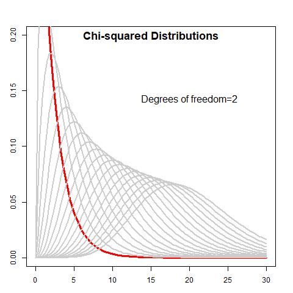

```{r setup, include=FALSE}
# This is an R setup chunk, containing default options applied to all other chunks
library(knitr)
# This sets the chunk default options
opts_chunk$set(cache=TRUE, collapse=TRUE, error=FALSE, prompt=TRUE, size="scriptsize")
# This sets the chunk display theme
knit_theme$set(knit_theme$get("acid"))
# This sets some display options
options(digits=3)
options(width=80)
```


<!-- This is an example of a regular html comment -->
<!--- This is an example of a special completely ignored comment -->


## Creating slide presentations using *RStudio*

*RStudio* has developed two related file formats designed for creating slide presentations: the *R Markdown* format (files with extension *.Rmd*) and the *RPresentations* format (files with extension *.Rpres*).  Both formats use the *R Markdown* flavor of the *markdown* markup language, but differ in the way they are rendered into slide presentations. 

*R Markdown* files can be rendered into either one of two interactive *html* slide presentations: **ioslides** or *slidy*, or into non-interactive *pdf* slide presentations.  *R Markdown* documents can also be rendered into standard *pdf* or *html* documents that aren't slides.

Both **ioslides** and *slidy* slide presentations can have embedded in them interactive plots, like *shiny*, *dygraphs*, and *plotly*.  **ioslides** and *slidy* presentations with embedded *dygraphs* or *plotly* interactive plots can be produced as single, standalone *html* files, which makes them easy to share.  But slide presentations with embedded *shiny* interactive plots contain a live *R* session, so they can't be saved as a single file. 

*RStudio* offers several tutorials about writing presentations in *R Markdown*:

Introduction to *R Markdown*:
[*R Markdown*](http://rmarkdown.RStudio.com/)

Authoring *R Markdown* Presentations:
[Authoring *R Markdown* Presentations](https://support.RStudio.com/hc/en-us/articles/200486468-Authoring-R-Presentations)


## The *RPresentations* format

The *RPresentations* document format allows embedding *R* chunks, and static visualizations of data (plots and charts), but not *shiny* applications. *RPresentations* can be saved as standalone *html* files.  One advantage of *RPresentations* is that they allow for creating slides with two columns.  The *RPresentations* document format is now deprecated in favor of the pure *R Markdown* format.  

Introduction to RPresentations:
[RPresentations](https://support.RStudio.com/hc/en-us/sections/200130218-R-Presentations)


## Interactive **ioslides** Slide Presentations  

**ioslides** is an interactive *html* slide presentation format developed by *RStudio*.  This presentation is an interactive **ioslides** presentation written in *R Markdown*.  

*RStudio* offers tutorials about writing presentations in *R Markdown*.
Introduction to *R Markdown*:
[*R Markdown*](http://rmarkdown.RStudio.com/)

Authoring *R Markdown* Presentations:
[Authoring *R Markdown* Presentations](https://support.RStudio.com/hc/en-us/articles/200486468-Authoring-R-Presentations)


*RStudio* offers several tutorials about writing interactive presentations in *R Markdown*.
Introduction to **ioslides**:
[*R Markdown*](http://rmarkdown.RStudio.com/*ioslides*_presentation_format.html)

This link offers a good introduction to *R Markdown* slide presentations, explaining the difference between **ioslides** presentations versus *slidy*:
[*R Markdown* slide presentation formats: **ioslides** versus *slidy*](http://data-analytics.net/cep/Schedule_files/presentations_demo.html)


## **ioslides** Slide Presentations | Rendered from *R Markdown* Documents

**ioslides** slide presentations are much better than powerpoint because they allow embedding interactive plots and other interactive elements encoded in *JavaScript*.  

This is an **ioslides** slide presentation rendered from an *R Markdown* document. *R Markdown* is a simple markup language derived from *markdown*.  *R Markdown* documents can be rendered into *HTML*, *pdf*, and *MS Word* documents.  *R Markdown* documents have the file extension `.Rmd`.

For more details on using *markdown* see [this *markdown* page](https://daringfireball.net/projects/markdown/), and for *R Markdown* see [this *R Markdown* page](http://rmarkdown.rstudio.com).  

*R Markdown* documents can be customized by directly using *HTML* code inside the `.Rmd` file.  

*R Markdown* files are rendered into slides and *pdf* documents using the [*package knitr*](https://yihui.name/knitr/).  

You can render (compile) an *R Markdown* file by clicking on the *knit* button in *RStudio*.  This creates an output document in the same directory as the *R Markdown* file, and also displays the output document.  


## How to include *R* code chunks  

*R Markdown* has additional features compared to *markdown*, like the ability to combine *R* code chunks with text.  

*R* code chunks can be embedded in *R Markdown* documents, and they are automatically executed and their output is embedded in the output document.  

The behavior of *R* code chunks can be controlled by using [code chunk options](https://yihui.name/knitr/options/).  

```{r mtcars, echo=TRUE}
head(mtcars)
```


## Two-column Layout Using *CSS* Code  

The formatting of *R Markdown* documents can be controlled using *CSS* code stored in a separate file.  The file with *CSS* code should be either in the same directory as the *R Markdown* file, or in a sub-directory.  

Below is an example of two-column layout using *CSS* code.  
The location of the break between columns is specified by the *CSS* style code in the file slides.css.  
The left column is 40%, and the right is 60% of the page width.  

<div class="column_left_50">
The left column contains *R* code that returns the summary of the *cars* data frame:  
```{r, sum_cars, eval=FALSE, echo=TRUE, results="hold"}
summary(cars)
```
</div>

<div class="column_right_50">
The right column contains the output of the *R* code in the left column:  
```{r, sum_cars, eval=TRUE, echo=FALSE}
```
Note that the `echo = FALSE` parameter was added to the code chunk to prevent printing of the *R* code.
</div>


## Slide with an Interactive *dygraphs* Plot  

<div class="column_left_50">

```{r, dygraphs_plot, eval=FALSE, echo=TRUE}
library(dygraphs, quietly=TRUE)
library(lubridate, quietly=TRUE)
xtsv <- log(zoo::coredata(EuStockMarkets[, "DAX"]))
datev <- date_decimal(zoo::index(EuStockMarkets))
xtsv <- xts::xts(xtsv, order.by=datev)
dygraph(xtsv, main = "DAX Index (log)") %>% 
  dyRangeSelector()
```

</div>

<div class="column_right_50">

```{r, dygraphs_plot, eval=TRUE, echo=FALSE, fig.width=5, fig.height=4}
```

</div>


## How to Include Images  

<div class="column_left_50">

Image files can be loaded and displayed by using the following *markdown* syntax:  
``  


The image file should be either in the same directory as the *R Markdown* file, or in a sub-directory.

</div>

<div class="column_right_50">

{width=400px, height=400px}

</div>


## Images in Two-column Layout Using *CSS* Code  

Image files can be included in two different ways.  First, directly by using *markdown* syntax for external links, or by using the function `include_graphics()` in an *R* code chunk.  

The image file should be either in the same directory as the *R Markdown* file, or in a sub-directory.  

<div class="column_left_50">

Hello World!  
Creating *R* Presentations isn't difficult at all!  
<!-- This is an example of using an R chunk and include_graphics() to show an image -->
```{r, echo=FALSE, out.width="50%"}
# This is an example of using an R chunk and include_graphics() to show an image
# Not that the chunk option out.width="50%" controls the image size
knitr::include_graphics("image/easy_button.png")
```

</div>

<div class="column_right_50">
R is fun!  
{width=200px, height=200px}
</div>


## Plots in Two-column Layout Using *CSS* Code  

<div class="column_left_50">
The Normal probability density function is given by:
$$
  P(x) = \frac{e^{-(x-\mu)^2/2\sigma^2}}{\sigma\sqrt{2 \pi}}
$$
Code for plotting the Normal probability density function:

```{r normal_dist_css, eval=FALSE, echo=(-(1:2)), results="hold"}
par(mar=c(2, 1, 2, 1))  # Set plot margins
par(oma=c(1, 1, 1, 1))  # Set outer margins
# Plot a Normal probability distribution
curve(expr=dnorm(x, sd=1.5), type="l", xlim=c(-5, 5),
      xlab="", ylab="", lwd=2, col="blue", 
      main="Normal Density Function")
# Draw shaded area
xvar <- seq(-5, 5, length=100)
yvar <- dnorm(xvar, mean=0.0, sd=1.5)
startd <- 2; endd <- 3
subv <- ((xvar >= startd) & (xvar <= endd))
polygon(c(startd, xvar[subv], endd),
        c(-1, yvar[subv], -1), col="red")
```

</div>

<div class="column_right_50">

Plot of Normal probability density function:

```{r, normal_dist_css, eval=TRUE, echo=FALSE, fig.width=5, fig.height=4}
```
Note that the `echo = FALSE` parameter was added to the code chunk to prevent printing of the *R* code that generated the plot.
</div>


## Slide with *HTML Widget*  

Below is a network graph created using the *D3.js JavaScript* library embedded as an *HTML widget*.  
You can select and drag the nodes of the *widget* using your mouse.  

<div class="column_left_40">
```{r, d3net, eval=FALSE, echo=TRUE, results="hold"}
library(networkD3, quietly=TRUE)
data(MisLinks, MisNodes)
forceNetwork(Links=MisLinks, Nodes=MisNodes, 
  Source="source", Target="target", Value="value", 
  NodeID="name", Group="group", opacity=0.8)
```

</div>

<div class="column_right_60">

```{r, d3net, eval=TRUE, echo=FALSE, fig.width=6, fig.height=4}
```

</div>


## Slide with Incremental Bullets

Regular Bullets:  

- Bullet 1
- Bullet 2
- Bullet 3


Incremental Bullets:  

> - Bullet 1
> - Bullet 2
> - Bullet 3


## Slide with Incremental Bullets and Elements {.build}

Incremental Bullets:  

- Bullet 1
- Bullet 2
- Bullet 3

Incremental Text:  
You can build up  
a slide from elements  
one at a time  

