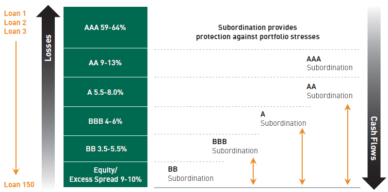
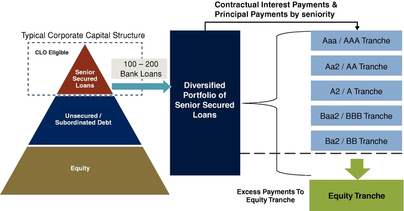

```{r setup, include=FALSE}
# This is an R setup chunk, containing default options applied to all other chunks
library(knitr)
# This sets the chunk default options
opts_chunk$set(cache=TRUE, collapse=TRUE, error=FALSE, prompt=TRUE)
# This sets the chunk display theme
knit_theme$set(knit_theme$get("acid"))
# This sets some display options
options(digits=3)
options(width=80)
```


## Collateralized Debt Obligations *CDOs*


<div class="column_left50">
Collateralized Debt Obligations (cash CDOs) are securities (bonds) collateralized by other debt assets.  
The CDO assets can be debt instruments like bonds, loans, and mortgages.  

The CDO liabilities are CDO tranches, which receive cashflows from the CDO assets, and are exposed to their defaults.  

CDO tranches have an attachment point (subordination, i.e. the percentage of asset default losses at which the tranche starts absorbing those losses), and a detachment point when the tranche is wiped out (suffers 100% losses).  

The equity tranche is the most junior tranche, and is the first to absorb default losses.  

The mezzanine tranches are senior to the equity tranche and absorb losses ony after the equity tranche is wiped out.  

The senior tranche is the most senior tranche, and is the last to absorb losses.  

</div>

<div class="column_right50">
{width=50%}
{width=50%}

</div>


## *shiny* Application for CDO tranche Losses

This is an embedded external *shiny* application, for calculating CDO tranche losses under the Vasicek model.  
It uses the function shinyAppDir() which executes R code contained in the files ui.R and server.R, stored in the subdirectory shinyapp_cdo_tranche:

```{r, eval=TRUE, echo=FALSE, cache=FALSE}
library(shiny)
shinyAppDir(
  appDir="shinyapp_cdo_tranche",
  options=list(width="100%", height=400)
  )  # end shinyAppDir
```


