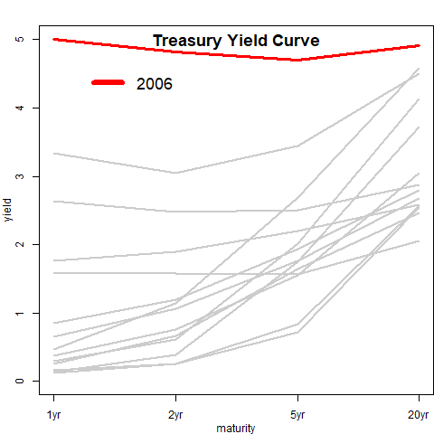

```{r setup, include=FALSE}
# This is an R setup chunk, containing default options applied to all other chunks
library(knitr)
# This sets the chunk default options
opts_chunk$set(cache=TRUE, collapse=TRUE, error=FALSE, prompt=TRUE, size="scriptsize")
# This sets the chunk display theme
knit_theme$set(knit_theme$get("acid"))
# This sets some display options
options(digits=3)
options(width=80)
```


## Animated *gif* of the Treasury Yield Curve  

<div class="column_left_50">

The yield curve shape changes depending on the economic conditions: 

In recessions rates drop and the curve flattens, 

While in expansions rates rise and the curve steepens.

</div>

<div class="column_right_50">



</div>

