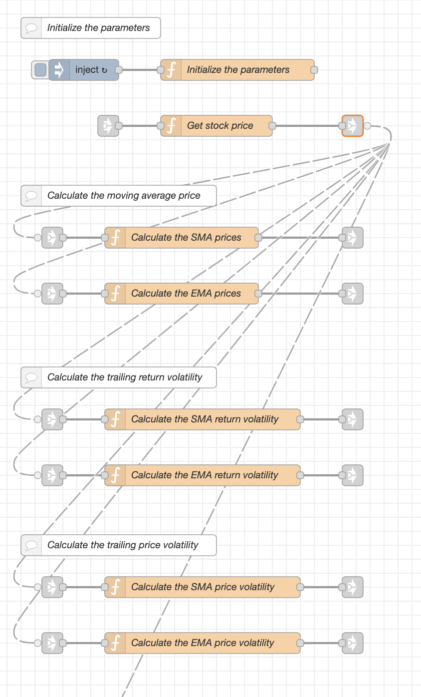
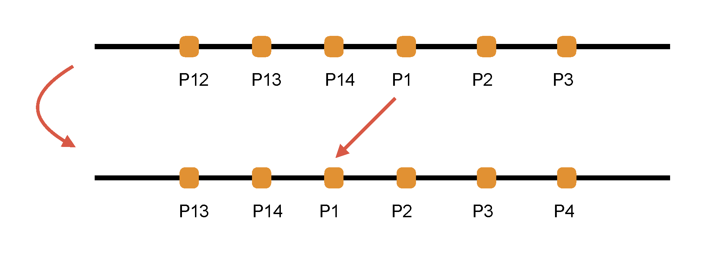
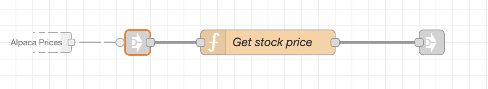
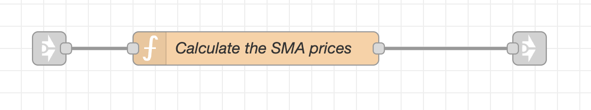

The Node-RED flow named *Tech indicators* contains implementations of the moving average price and volatility in MachineTrader.

You can download this flow from the [MachineTrader repository on GitHub](https://github.com/predictivetechnologysystems/MachineTrader-Community).

Let's take a look at the flow named *Tech indicators*:  

The dashed lines are the connectors for passing the live streaming stock prices between function nodes. 

The function node *Initialize the parameters* creates flow variables needed for the calculations.  

* symboln = the ticker string of the stock. 
* lambdap = the lambda decay parameter. 
* volf = the volatility floor. 
* pricec = the current stock price. 
* pricep = the previous stock price, initially set to NaN. 
* pricema =  the moving average price, initially set to NaN. 
* dataq = the data queue for stock prices or returns. 
* lookb = the look-back interval, i.e. the number of elements in the data queue. 
* endq = the position of the end of the queue within the data queue. 

The data queue is an array (vector) for storing the stock prices or returns.
The data queue is a first in last out queue.  The data is stored in the order it's received.
New data is written to the end of the queue, and the endq variable is shifted to the next to last element.
Data is added one element at a time.
This way the other data elements in the queue don't have to be copied, which speeds up the code.
Below is an illustration of how an element is added to the data queue:

The function node *Get stock price* accepts the streaming prices for all the stocks from the flow *Alpaca Prices*, it extracts the prices only for the ticker *symboln*, and it passes them to the other nodes.

The streaming prices flow into the small *link-in node* on the left and the prices flow out of the *link-out node* on the right.

 

The function node *Calculate moving average prices* calculates the moving average prices.

$${\normalsize \bar{p} = \frac{1}{n} \sum\limits_{i=1}^{n} r_{i}}$$

 

The function node *Calculate the EMA prices* calculates the exponential moving average prices.

 

The function node *Calculate moving average volatility* calculates the moving average volatility.

$${\normalsize\sigma^2 = \frac{1}{n-1} \sum\limits_{i=1}^{n} \left( r_{i} - \bar{r} \right)^2}$$

 

The function node *Calculate EMA volatility* calculates the exponential moving average volatility.

accepts the streaming prices for all the stocks from the flow *Alpaca Prices*, it extracts the prices only for the ticker *symboln*, and it passes them to the other nodes.

 
 
 
 

