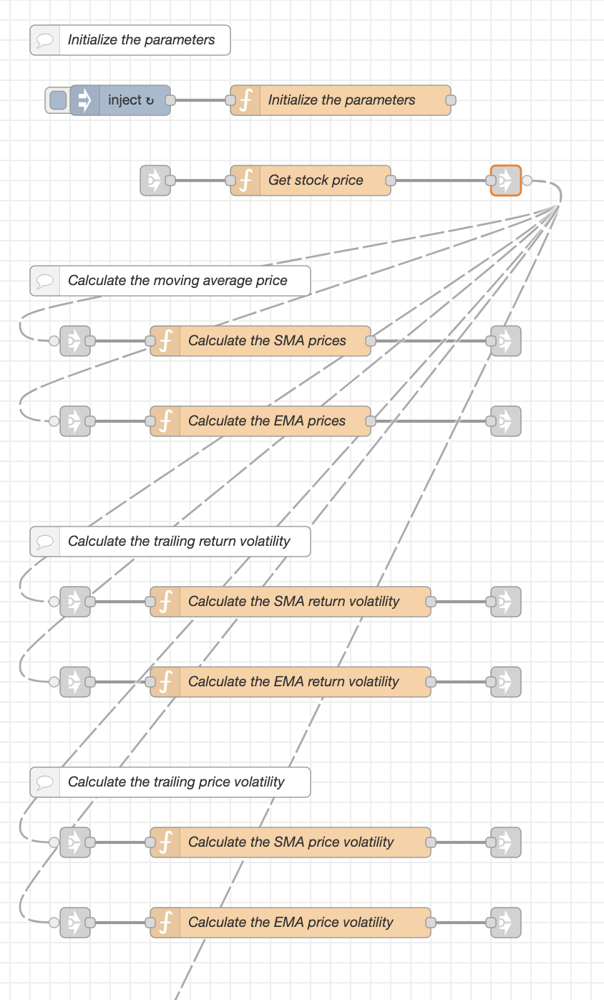
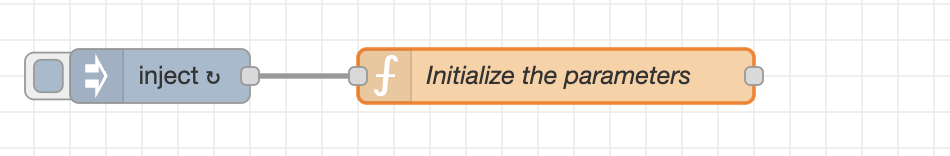
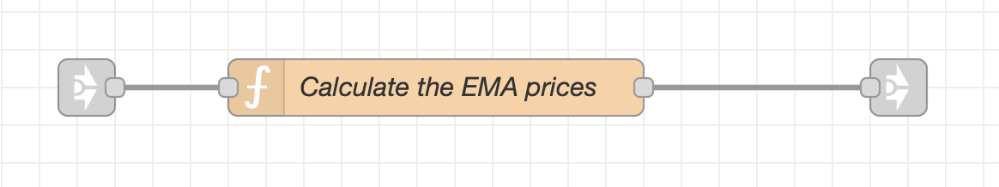

### The Moving Average Price  

The moving average prices can be calculated for a streaming time series of prices $p_i$.  

The Simple Moving Average (SMA) price $p^{SMA}_i$ is the average of the past prices $p_{i-j}$ over a look-back window $lb$:

$${\normalsize p^{SMA}_i = \frac{1}{lb} \sum\limits_{j=1}^{lb} p_{i-j}}$$
The parameter $lb$ is equal to the size of the look-back window.  

**The drawback of the SMA is that it applies the same weight to the recent and past prices.**
Its calculation also requires maintaining a buffer (queue) of past prices, with the size equal to the parameter $lb$.

 

The Exponential Moving Average (EMA) price $p^{EMA}_i$ is calculated using a decay factor $\lambda$ and the recursive formula: 

$${\normalsize p^{EMA}_i = \lambda p^{EMA}_{i-1} + (1-\lambda) p_{i-1}}$$

The above recursive formula can be expressed as a series:

$${\normalsize p^{EMA}_i = (1-\lambda) \sum\limits_{j=1}^{\infty} {\lambda}^{j-1} p_{i-j} = (1-\lambda) (p_{i-1} + \lambda p_{i-2} + \lambda^2 p_{i-3} + \ldots)} $$
The formula is called exponential because the decay factor $\lambda$ is raised to the power of $j-1$: $\lambda^{j-1}$.  

**The advantage of the EMA is that it applies a greater weight to more recent prices than to past ones.**  

And it doesn't forget the past prices completely - it only applies a smaller weight to them.  
Its calculation is also faster because there's less computation, and it doesn't require maintaining a buffer (queue) of past prices.  

**The SMA and EMA averages are not the same, but they are related to each other, and they move in sympathy with each other.**  

 

 

### The Moving Average Variance of Returns  

The moving average variance of returns $\sigma^2_i$ measures the dispersion of the streaming returns around the moving average return.
It can be calculated for a streaming time series of prices $p_i$.  

The dollar return $r_i$ is the difference between the current price $p_i$ minus the previous price $p_{i-1}$:
$${\normalsize r_i = p_i - p_{i-1}}$$

The Simple Moving Average (SMA) return $r^{SMA}_i$ is equal to the average of the past returns:

$${\normalsize r^{SMA}_i = \frac{1}{lb} \sum\limits_{j=1}^{lb} r_{i-j}}$$

The Simple Moving Average (SMA) variance $\sigma^{2 SMA}_i$ is then given by the sum:

$${\normalsize \sigma^{2 SMA}_i = \frac{1}{lb-1} \sum\limits_{j=1}^{lb} (r_{i-j} - r^{SMA}_{i-1})^2}$$  

Note that the average return $r^{SMA}_{i-1}$ is from the previous time step, to better capture the unexpected return in the current time step.

 

The Exponential Moving Average (EMA) variance $\sigma^{2 EMA}_i$ is calculated using the two recursive formulas: 

$${\normalsize \sigma^{2 EMA}_i = \lambda \sigma^{2 EMA}_{i-1} + (1-\lambda) (r_i - r^{EMA}_{i-1})^2}$$
$${\normalsize r^{EMA}_i = \lambda r^{EMA}_{i-1} + (1-\lambda) r_{i-1}}$$

**The SMA and EMA variances are not the same, but they are related to each other, and they move in sympathy with each other.**  

If the decay factor $\lambda$ is closer to $1$ (one) then the EMA variance adjusts slowly to new prices, corresponding to a longer look-back window $lb$.
If $\lambda$ is closer to $0$ (zero) then the EMA variance adjusts quickly to new prices, corresponding to a shorter look-back window $lb$.  

 

### The Moving Average Variance of Prices  

The moving average variance of prices $\sigma^2_i$ measures the dispersion of the streaming prices around the moving average price.
It can be calculated for a streaming time series of prices $p_i$.  

The Simple Moving Average (SMA) price $p^{SMA}_i$ is equal to the average of the past prices:

$${\normalsize p^{SMA}_i = \frac{1}{lb} \sum\limits_{j=1}^{lb} p_{i-j}}$$

The Simple Moving Average (SMA) variance $\sigma^{2 SMA}_i$ is then given by the sum:

$${\normalsize \sigma^{2 SMA}_i = \frac{1}{lb-1} \sum\limits_{j=1}^{lb} (p_{i-j} - p^{SMA}_{i-1})^2}$$  

Note that the average price $p^{SMA}_{i-1}$ is from the previous time step, to better capture the unexpected price in the current time step.

 

The Exponential Moving Average (EMA) variance of prices $\sigma^{2 EMA}_i$ is calculated using the two recursive formulas: 

$${\normalsize \sigma^{2 EMA}_i = \lambda \sigma^{2 EMA}_{i-1} + (1-\lambda) (p_i - p^{EMA}_{i-1})^2}$$
$${\normalsize p^{EMA}_i = \lambda p^{EMA}_{i-1} + (1-\lambda) p_{i-1}}$$

**The variance of returns and of prices measure different forms of dispersion.**

Take for example the extreme case when the returns are constant $r_i = r$.  
Then the prices $p_i = \sum {r_i}$ increase in a straight line.  The variance of returns is zero, but the variance of prices is not zero.
So if the prices exhibit a significant trend, then the variance of prices is large, even if the variance of returns is small.

Another example is Brownian motion.  The returns are normally distributed, with a constant volatility.  But the variance of prices is not constant, and it increases with the factor $\lambda$, since then prices have more time to drift.

 

### Choosing The Decay Factor $\lambda$ And The Look-back window $lb$ 

**The decay factor $\lambda$ determines the persistence of data memory, i.e. how quickly the contribution of the past data to the average value, fades over time.**  

If the decay factor $\lambda$ is closer to $1$ (one) then the effect of past data fades slowly over time.
If $\lambda$ is closer to $0$ (zero) then the effect of past data fades quickly over time.  

**The length of the look-back window also determines the persistence of data memory.**  

In the Simple Moving Average (SMA), the data which is more than $lb$ time periods in the past is abruptly forgotten.
If the window is short, then only very recent data is used in the calculation of the average.
If the window is long, then older data is used in the calculation of the average.  

**The decay factor $\lambda$ and the look-back window $lb$ are related to each other.**  

If the decay factor $\lambda$ is closer to $1$ (one) then the EMA adjusts slowly to new prices, corresponding to a longer look-back window $lb$.
If $\lambda$ is closer to $0$ (zero) then the EMA adjusts quickly to new prices, corresponding to a shorter look-back window $lb$.  

smoothing 

machine learning

bias-variance tradeoff

overfitting

 

### Implementation of the Moving Average Price and Volatility  

**The Node-RED tab named *Tech indicators* contains implementations of various technical indicators in MachineTrader, including the moving average price and volatility.**  

The tab named *Tech indicators* calculates the moving average prices and volatilities from live streaming stock prices for a single selected stock.

You can download the tab named [**Tech indicators**](https://github.com/predictivetechnologysystems/MachineTrader-Community/blob/main/Tech_Indicators.json) from the MachineTrader-Community repository on GitHub.  

You should also download the tabs named [**Alpaca Prices**](https://github.com/predictivetechnologysystems/MachineTrader-Community/blob/main/Alpaca_Prices.json), and [**Globals**](https://github.com/predictivetechnologysystems/MachineTrader-Community/blob/main/Globals_jp.json).  

After you download the tab named *Tech indicators*, you must connect the *link-in node* to the left of the function node named *Get stock price* to the *link-out node* called *Prices out* in the tab *Alpaca Prices*.  

You can also watch an instructional video about [**Calculating Moving Average Prices And Volatilities**](https://youtu.be/iAZMTEZeZDM) on the MachineTrader YouTube channel.  

 

**Let's take a look at the tab named *Tech indicators*.**  

The function node named *Initialize the parameters* creates flow variables needed for the calculations.
It should be run once before the other nodes are run, by pressing the *inject* node on the left.  

The multiple stock prices stream in from the tab *Alpaca Prices* into the node named *Get stock price*, through the small *link-in node* to its left.
The function node *Get stock price* selects the prices only for the ticker in the tab variable *symboln*.
The single stock prices then stream out through the small *link-out node* to its right, to the nodes which calculate the moving averages.  

The dashed lines are the connectors for passing the live streaming stock prices to the function nodes.  

 

**The function node named *Initialize the parameters* creates the flow variables needed for the calculations:**  

It should be run once before the other nodes are run, by pressing the *inject* node on the left.
The *inject* node is on a timer, to run on weekdays at 9:30 AM, so that all the flow variables are initialized before the start of stock trading.

The function node named *Initialize the parameters* creates the following flow variables:  

* symboln = the ticker string of the selected stock. 
* lambdaf = the lambda decay factor which multiplies past estimates. 
* volf = the volatility floor. 
* pricec = the current stock price. 
* pricep = the previous stock price, initially set to NaN. 
* pricema =  the moving average price, initially set to NaN. 
* lb = the look-back window, i.e. the number of elements in the data queue. 
* priceq = the data queue (buffer) for storing the recent stock prices. 
* endpq = the position of the end of the price queue. 
* retq = the data queue (buffer) for storing the recent stock returns. 
* endrq = the position of the end of the returns queue. 

 

**The data queue is used for calculating the simple moving averages of prices and volatilities.**

The data queue is an array (vector) for storing the recent stock prices or returns.
The data queue only stores the most recent number of elements equal to *lb*.  
The data queue is a first in last out queue.
Data is added one element at a time and it's stored in the order it's received.
New data is written to the end of the queue, and the *endq* variable is shifted to the next to last element.  
The element *P14* at the end of the queue is replaced with new data and becomes the element *P1* at the front of the queue.  
The element *P13* becomes the end of the queue *P14*.
The data elements in the queue are just relabeled - not copied.
This avoids copying the other data elements in the queue, which speeds up the code.

Below is an illustration of how an element is added to the data queue:

. 

 

**The function node named *Get stock price* obtains the streaming prices for the ticker *symboln* from the tab named *Alpaca Prices*.**

The prices for all the stocks stream from the tab *Alpaca Prices* into the small *link-in node* on the left.  
The function node *Get stock price* then extracts the prices only for the ticker *symboln*, and it passes them to the small *link-out node* on the right.  The streaming stock prices from the *link-out node* can then be passed to the other nodes and strategy tabs.  

For the live prices to stream, it's necessary to download and install the tabs named *Alpaca Prices* and *Globals*.  Then you must connect the *link-in node* to the left of the function node named *Get stock price* to the *link-out node* called *Prices out* in the tab *Alpaca Prices*.  

 

**The function node named *Calculate the SMA prices* calculates the simple moving average prices.**

The stock prices flow from the node *Get stock price* into the small *link-in node* on the left.  The function node *Calculate the SMA prices* then calculates the simple moving average prices, and it passes them to the small *link-out node* on the right.  The streaming SMA prices from the *link-out node* can then be passed to the other nodes and strategy tabs.  

 

**The function node named *Calculate the EMA prices* calculates the exponential moving average prices.**

The stock prices flow from the node *Get stock price* into the small *link-in node* on the left.  The function node *Calculate the EMA prices* then calculates the exponential moving average prices, and it passes them to the small *link-out node* on the right.  The streaming EMA prices from the *link-out node* can then be passed to the other nodes and strategy tabs.  

 

**The function node named *Calculate the SMA return volatility* calculates the simple moving average volatility of the stock returns.**

The stock prices flow from the node *Get stock price* into the small *link-in node* on the left.  The function node *Calculate the SMA return volatility* then calculates the SMA return volatility, and it passes it to the small *link-out node* on the right.  The streaming SMA return volatility from the *link-out node* can then be passed to the other nodes and strategy tabs.  

 

**The function node named *Calculate the EMA return volatility* calculates the exponential moving average volatility of the stock returns.**

The stock prices flow from the node *Get stock price* into the small *link-in node* on the left.  The function node *Calculate the EMA return volatility* then calculates the EMA return volatility, and it passes it to the small *link-out node* on the right.  The streaming EMA return volatility from the *link-out node* can then be passed to the other nodes and strategy tabs.  

 

**The function node named *Calculate the SMA price volatility* calculates the simple moving average volatility of the stock prices.**

The stock prices flow from the node *Get stock price* into the small *link-in node* on the left.  The function node *Calculate the SMA price volatility* then calculates the SMA price volatility, and it passes it to the small *link-out node* on the right.  The streaming SMA price volatility from the *link-out node* can then be passed to the other nodes and strategy tabs.  

 

**The function node named *Calculate the EMA price volatility* calculates the exponential moving average volatility of the stock prices.**

The stock prices flow from the node *Get stock price* into the small *link-in node* on the left.  The function node *Calculate the EMA price volatility* then calculates the EMA price volatility, and it passes it to the small *link-out node* on the right.  The streaming EMA price volatility from the *link-out node* can then be passed to the other nodes and strategy tabs.  

 
