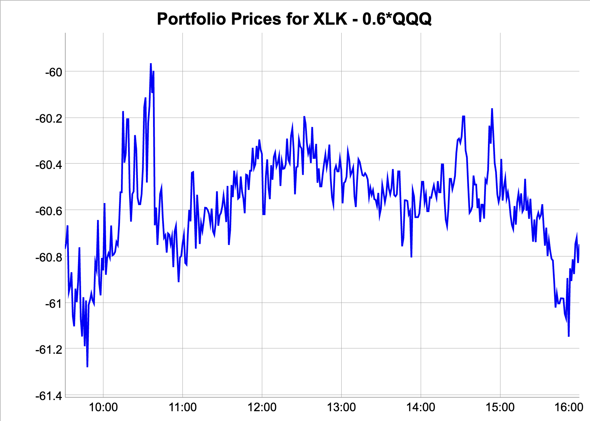
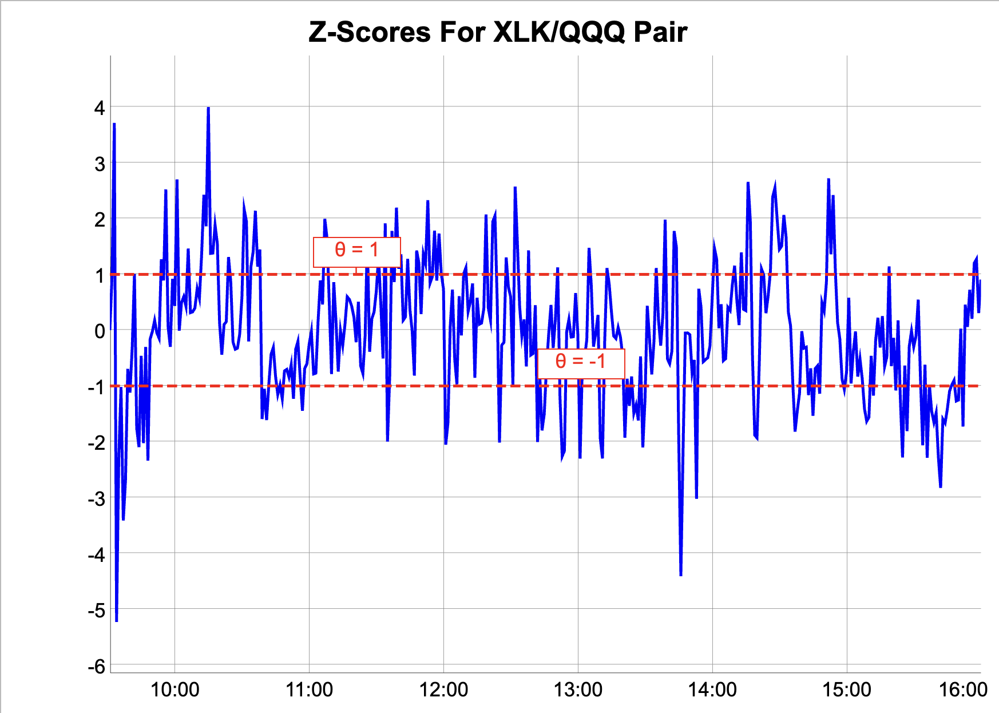
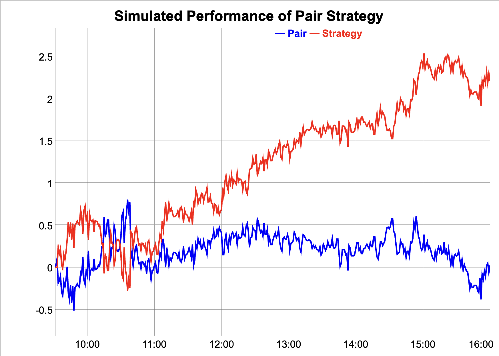

### The Pair Portfolio  

The *Pair strategy* trades a portfolio of two stocks as if they were a single stock.  
When the strategy buys the pair, it buys $w_1$ shares of *stock1* and $w_2$ shares of *stock2*, and vice versa.  

Typically, the weight $w_1$ is positive and the weight $w_2$ is negative.  So if the strategy is long one pair, it's long $w_1$ shares of *stock1* and short $w_2$ shares of *stock2*, and vice versa.  

The price of the stock pair is equal to the sum of the prices of the two stocks: $p = w_1 p_1 + w_2 p_2$.  

The stock pair and their weights $w_1$ and $w_2$ are often chosen so that the portfolio price is range-bound (stationary) around an equilibrium price.  

Below is a plot of the prices of the pair portfolio consisting of 1 share of XLK long ($w_1 = 1$) vs $0.6$ shares of QQQ short ($w_2 = -0.6$), for May 31st, 2024.  
The stock pair XLK and QQQ was selected because they are ETFs, and their portfolios have a significant overlap among technology and growth stocks, so their prices are highly correlated.  

{width="500" height="350"}  

### The Z-scores of the Pair  

The strategy determines if the portfolio is expensive (rich) or cheap depending on the value of the z-score compared to the threshold level $\theta$.  

The z-score $z_t$ is equal to the difference between the current portfolio price $p_t$ minus the equilibrium price $p_e$, divided by the moving average volatility of the prices $\sigma_t$:
$${\normalsize z_t = \frac{p_t - p_e}{\sigma_t}}$$  

The equilibrium price $p_e$ is often chosen to be the moving average price $p_e = \bar{p}_t$.  
You can read more about the moving average prices and volatilities below, and also in 
[**this document**](https://algoquant.github.io/2024/06/17/Moving-Averages-Theory/).  

As an alternative, the equilibrium price can be chosen to be the last trade price $p_f$ - the price at which the last trade was filled (executed).  The advantage of this is that it prevents a subsequent trade at a loss.  For example, a subsequent buy at a higher price than the previous sell, etc.  

Below is a plot of the z-scores for intraday 1-minute XLK/QQQ pair prices for May 31st, 2024.  
The z-score equilibrium price $p_e$ was chosen to be the moving average price $p_e = \bar{p}_t$, with $\lambda = 0.9$.  See below for more details on the moving average prices.  
In this case, the z-scores oscillate around zero, and they can be positive or negative.  
The horizontal dashed lines are for the threshold levels $\theta = 1$ and $\theta = -1$.  

{width="500" height="350"}  

### The Pair Strategy  

The *Pair strategy* is designed to capture the reversion of the pair portfolio price to its equilibrium value, and it buys the pair when it's cheap, and sells it when it's expensive (rich).  

The strategy buys $1$ pair if it's cheap (the z-score is less than minus the threshold level $z_t < -\theta$), and it sells $1$ pair if it's expensive (the z-score is greater than the threshold level $z_t > \theta$).  

The strategy has several options for establishing positions depending on the value of the z-score.  
It can maintain either a single long or a short position, and switch only when the z-score value crosses the threshold $\theta$.  
Or it can add positions as the z-score value continues increasing above the threshold $\theta$ (double down).  It then accumulates an inventory of positions, either long or short, up to the position limit.  

### The Pair Strategy Performance  

Below is the simulated performance of the *Pair strategy* for a single day, May 31st, 2024, using the above z-scores.  
The *Pair strategy* maintains a single long or short position, and switches when the z-score value crosses the threshold $\theta$.  
It assumes the transaction cost of $\$0.05$ for trading a pair.  The strategy executes $61$ trades during this day.  
The *Pair strategy* achieves a cumulative profit of almost $\$2.5$, while the static pair is almost flat.  
The simulated performance is hypothetical, and assumes that the optimal values of the portfolio weights and the threshold level $\theta$ are known.  In reality, the live performance will often be much lower than this example.  

{width="500" height="350"}  

You can read more about the implementation of the *Pair strategy* in 
[**this document**](https://algoquant.github.io/2024/06/30/Pair-Strategy-Implementation/).  

 

### The Pair Strategy Parameters  

The performance of the *Pair strategy* depends on the choice of the stock pair, and on the values of its two parameters: the lambda decay parameter $\lambda$, and the z-score threshold level $\theta$.  

The stock pairs are selected so that the price of the portfolio is range-bound (stationary) around an equilibrium price.  This is often achieved by selecting ETFs with related or overlapping portfolios.  Or by selecting stocks from the same industry or sector.

The decay parameter $\lambda$ is used for calculating the moving average prices and volatilities.  

If $\lambda$ is closer to $1$ then the moving average price has a stronger dependence on the past prices, and it adjusts more slowly to the current prices.  
In this case, the difference between the current price and the moving average price can be large.  
The range of the z-score values is also large.  

If $\lambda$ is closer to $0$ then the moving average price adjusts quickly to the current prices, and the difference between the current price and the moving average price is small.  
The range of the z-score values is also small.  

The parameter $\theta$ is used to determine if the z-score value indicates that the stock is mispriced (its price is cheap or expensive).  

### Calibration of the Pair Strategy  

For the purpose of calibration, the historical prices can be split into in-sample prices (past training set) and out-of-sample prices (future test set).  

The *Pair strategy* is simulated on the training set prices, and the values of the $\lambda$ and $\theta$ parameters are chosen to maximize its performance.  For example, to maximize its cumulative profits (PnLs), or to maximize its Sharpe ratio.  
The *Pair strategy* is then simulated on the test set prices, to test the performance of the calibrated model.  

For example, we could select the past 20 days of intraday stock prices for the training set data, and find the values of the $\lambda$ and $\theta$ parameters which maximize the cumulative PnL for that time interval.  
We could then run the calibrated *Pair strategy* on live prices on the next day, to test its out-of-sample performance.  

The values of the optimal $\lambda$ and $\theta$ parameters depend on the length of the training set data (the training set).  
A smaller training set (say only 10 past days) results in a greater variance (variability) of the optimal parameters.  
A larger training set (say 30 past days) results in a lower variance of the optimal parameters (thanks to diversification), but at the cost of a larger bias, because the optimal parameters adjust more slowly to the new prices.  

This is an example of the *bias-variance tradeoff* with respect to the size of the training set.  
A smaller training set has a smaller bias (it adjusts quickly to the new prices), but a larger variance (the optimal parameters change significantly over time).  
A larger training set has a smaller variance, but it also has a larger bias (it adjusts more slowly to the new prices).  
To achieve good out-of-sample performance, the optimal parameters should have both a small bias and a small variance.  
Achieving the best *bias-variance tradeoff* is one of the major objectives of *machine learning*.  

Choosing the right model parameters is difficult.  It is the responsibility of the investor to make that choice.  

 

### The Moving Average Prices  

The moving average prices can be calculated for a streaming time series of prices $p_t$.  

The Exponential Moving Average (EMA) price $\bar{p}_t$ is calculated using a decay parameter $\lambda$ and the recursive formula: 

$${\normalsize \bar{p}_t = \lambda \bar{p}_{t-1} + (1-\lambda) p_t}$$

The moving average price at time $t$: $p_t$ is equal to the decay parameter $\lambda$ times the moving average price at time $t-1$: $p_{t-1}$, plus $(1-\lambda)$ times the price at time $t-1$: $\bar{p}_{t-1}$.

The decay parameter $\lambda$ determines the persistence of data memory, i.e. how quickly the contribution of the past data to the average value fades over time.  

If the decay parameter $\lambda$ is closer to $1$ then the effect of past data fades slowly over time.
If $\lambda$ is closer to $0$ then the effect of past data fades quickly over time.  

The above recursive formula can be expressed as a series:

$${\normalsize \bar{p}_t = (1-\lambda) \sum\limits_{j=0}^{\infty} {\lambda}^j p_{t-j} = (1-\lambda) (p_t + \lambda p_{t-1} + \lambda^2 p_{t-2} + \ldots)} $$

The formula is called *exponential* because the decay parameter $\lambda$ is raised to the power of $j$, so the weights $\lambda^j$ decrease exponentially as $j$ increases.  

The advantage of the EMA price is that it applies a greater weight to more recent prices than to past ones.  

The EMA calculation is also faster because there's less computation, and it doesn't require maintaining a buffer (queue) of past prices.  

 

### The Moving Average Variance of Prices  

The moving average variance of prices $\sigma^2_t$ measures the dispersion of the streaming prices around the moving average price.
It can be calculated for a streaming time series of prices $p_t$.  

The Exponential Moving Average (EMA) variance of prices $\sigma^2_t$ is calculated using the two recursive formulas: 

$${\normalsize \sigma^2_t = \lambda \sigma^2_{t-1} + (1-\lambda) (p_t - \bar{p}_{t-1})^2}$$
$${\normalsize \bar{p}_t = \lambda \bar{p}_{t-1} + (1-\lambda) p_t}$$

The moving average variance at time $t$: $\sigma^2_t$ is equal to the decay parameter $\lambda$ times the moving average variance at time $t-1$: $\sigma^2_{t-1}$, plus $(1-\lambda)$ times the squared difference between the current price $p_t$ minus the moving average price at time $t-1$: $\bar{p}_{t-1}$.

 

### Choosing The Decay parameter $\lambda$

The moving average prices are a smoothed version of the streaming prices.  

**The decay parameter $\lambda$ determines the strength of the data smoothing.**  

If $\lambda$ is closer to $1$ then the moving average prices are smoother, but if it's closer to $0$ then the average prices are more variable and they follow the streaming prices more closely.

The effect of the decay parameter $\lambda$ on the moving average prices is illustrated in the animated plot below of VTI stock prices.  When $\lambda = 0.99$ the average prices are very smooth, but as it decreases, they become more variable and they follow the streaming prices more closely.

<video src="figure/EMA.mp4" width="600" height="500" controls playsinline autoplay muted loop/>

 

**The moving average prices are less volatile (smoother), but they also lag behind the streaming prices - they are *biased*.**  
Notice for example that the average prices (red line above) reach their minimum much later than the streaming prices (blue line).  
And the smoother the average prices are, the more biased they are.  
A lower variance is desirable, but it comes at the cost of a larger bias (time lag).  
This is an example of the *bias-variance tradeoff*.  
Achieving the best *bias-variance tradeoff* is one of the major objectives of *machine learning*.  

**The decay parameter $\lambda$ is usually chosen to achieve the best *bias-variance tradeoff*.**  

The best tradeoff depends on the application.  For example, if the streaming prices are very volatile, then a larger decay parameter $\lambda$ is desirable, to reduce the volatility.

**The optimal value of the decay parameter $\lambda$ can be determined using a simulation called *backtesting* (cross-validation).**  

Backtesting is performed on historical data.  
The data is split into in-sample (past training set) and out-of-sample (future test set) data sets.  
Forecasting models often require the smoothing of the data.  
The smoothing is applied to the training set data, and the forecasts are tested on the out-of-sample data.  
The value of $\lambda$ which minimizes the out-of-sample forecast errors is chosen as the optimal value.  

**The backtesting procedure risks *overfitting* to the historical data.**  
The optimal value of $\lambda$ may not be the best choice in live data.
So users should be cautious when selecting parameters using the backtesting procedure.  

